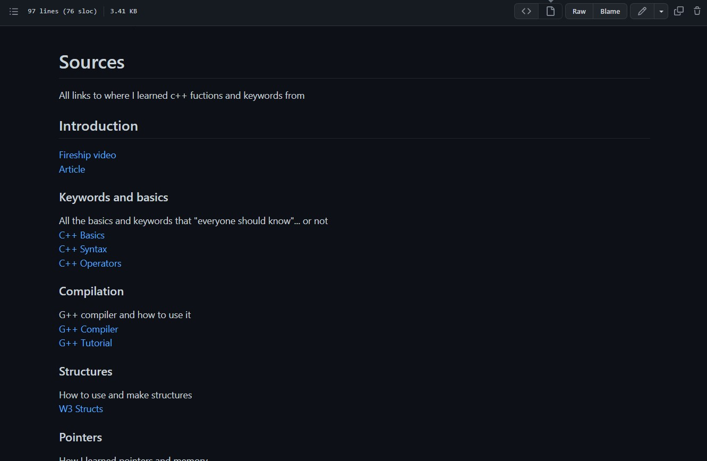

# Learning-C-With-Classes

How to teach yourself C++ in under a day

## Setup
First you need a code editor or IDE you can download both here  
[IDE](https://www.eclipse.org/downloads/)  
[Online IDE](https://replit.com/~) | Recommended for newbies  
[Code Editor](https://notepad-plus-plus.org/downloads/)  
[VS Code](https://code.visualstudio.com/Download) | Great code editor

## Learning 
After your environment is setup you better get to reading, head to Sources.MD  
and work through it link by link practicing each new skill in W3 online code editor.

## Practice
After you get tired of reading we are going to use all the things we learned to make a temperature converter!  
I recommend not following a tutorial and figuiring it out yourself with your new found knowledge  
but if you can't you can follow [this](http://www.trytoprogram.com/cpp-examples/cplusplus-program-to-convert-temperature/).

## Compilation
After you have coded your very own temperature converter its time to compile this source code  
into an Executable (.EXE) for this you will need to download G++ and learn the basics of compilation, everything you need is below.  
[G++](https://gcc.gnu.org/)  
[How To](https://www.tutorialspoint.com/How-to-compile-and-run-the-Cplusplus-program)

## Your Project
After you have everything down and read most the articles its time to make your own project in C++  
I think its better if you find your own idea beacuse then it will be something you care about but if you dont know  
what exactly to make ill list some examples below.  
1. Student Report Management System
2. Casino Number Guessing Game
3. Using Graphics to Draw and Move Shapes
4. Currency Converter

And remember google and stack overflow are your best freinds when learning.

### Contact Me
Discord: BadDeveloper#4200  
Email: Cooperransom08@outlook.com  
[Replit](https://replit.com/@cozi08) | [Twitter](https://twitter.com/ransom_cooper)
