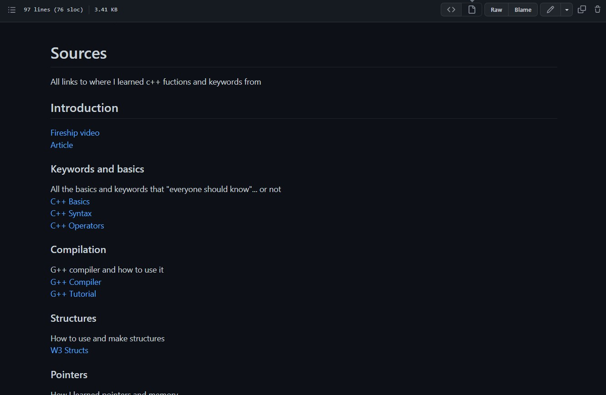

# Learning-C-With-Classes
How to teach yourself C++ in under a day

## Setup
First you need a code editor or IDE you can download both here  
[IDE](https://www.eclipse.org/downloads/)  
[Code Editor](https://notepad-plus-plus.org/downloads/)  

## Learning 
After your environment is setup you better get to reading, head to Sources.MD
and work through it link by link practicing each new skill in there online code editor

